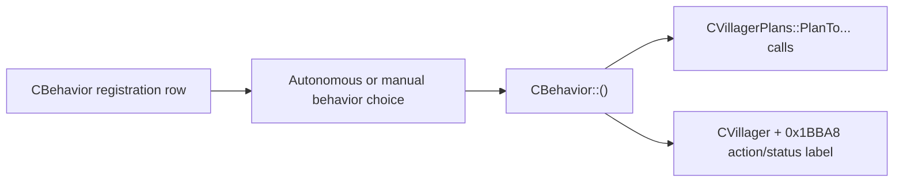

# Villager Behavior And Plan Dump

`work/dump_villager_action_plan_data.py` converts the current COFF-disassembly
text dumps into a human-readable behavior/plan inventory under
`outputs/villager-action-plan-dump/`.

The dump is evidence for patch planning only. It does not disassemble new
binaries; it groups the existing `CBehavior` and `CVillagerPlans` dumps,
extracts nearby x86 `push` constants before `PlanTo...` calls, and preserves
raw operands when arguments are indirect.

## Output Files

- `registered_behaviors.csv`: recovered `CBehavior` registration macro IDs.
- `villager_plan_apis.csv`: `CVillagerPlans::PlanTo...` methods and inferred
  argument names.
- `behavior_plan_calls.csv`: one row per recovered `CBehavior` to
  `CVillagerPlans` call.
- `villager_action_plan_dump.md`: readable report with plan calls grouped by
  behavior.

## Current Structure Notes

Confirmed useful villager fields:

| Offset | Current meaning |
| --- | --- |
| `CVillager+0x6A54` | Age/growth field. Stock gates use `< 0x118` as non-adult and `>= 0x118` as adult. |
| `CVillager+0x6A58` | Likely gender field. Stock routines compare it to `0/1` for gender-specific choices. |
| `CVillager+0x6A5C` | Likely body/clothing value, used by body/outfit graphics selection. |
| `CVillager+0x6A60` | Likely head/voice selector. `MomTeachingTalk` reads it while choosing baby-talk sounds; it is not a confirmed baby/nursing counter. |
| `CVillager+0x1BBA8` | Current action/status label buffer. Behavior routines copy string-manager text here with a `0x27` byte limit. |

Known content object constants in the current dump:

| Value | Meaning |
| --- | --- |
| `0x0D` | TV |
| `0x5B` | Hammock |

## Native Baby-Related Behaviors

These behavior constructors and registration IDs exist in the PC build. They
are not safe to enable as spontaneous nursing-mother variants until the actual
baby/babyplets ownership fields and handoff route are mapped.

| ID | Behavior |
| --- | --- |
| `0x070` | `ShowingBabyGarden` |
| `0x071` | `ShowingBabyToys` |
| `0x07B` | `CelebratingBaby` |
| `0x0FC` | `JealousAboutBaby` |
| `0x0FD` | `ExcitedAboutBaby` |
| `0x0FE` | `PlayingMommy` |
| `0x11F` | `TeachingFirstWords` |
| `0x181` | `WashBaby` |
| `0x182` | `ChangeBaby` |
| `0x18F` | `MomTeachingTalk` |

Useful string IDs/symbols seen near this subsystem include `Nursing`,
`eCaringBaby`, `eSayNursingFor`, `eSayTeachingBabyToTalk`, `eSayWashBaby`,
`eSayChangeBaby`, and `eSaySunBaby`.

## Second-Bathroom Leak Behaviors

Native north leak reactions are partly present:

| ID | Behavior |
| --- | --- |
| `0x132` | `FreakOutKitchenSinkLeak` |
| `0x133` | `FreakOutBathroomSinkLeak` |
| `0x134` | `FreakOutShowerLeak` |
| `0x135` | `FreakOutShowerLeakNorth` |
| `0x136` | `FreakOutToiletLeak` |
| `0x137` | `FreakOutToiletLeakNorth` |

No distinct `FreakOutBathroomSinkLeakNorth` symbol has been confirmed. Before
patching the second-bathroom leak event path, inspect
`CEventTheWaterPressureSurge::ImpactGame` and identify which content-map leak
objects are set when the north bathroom renovation exists.

## Behavior Variant Patching Guidance

For low-risk label variants, the B131 approach is preferred: call the native
behavior first, then replace only `CVillager+0x1BBA8` with a string-manager
result. This preserves route selection, animations, sounds, and object
targeting.

For new behaviors that require different furniture targets, positions, or
state mutation, clone a native behavior only after the dump proves its
`PlanToGo`, `PlanToWait`, object IDs, and side effects. Do not infer baby,
partner, or renovation state from string labels alone.
